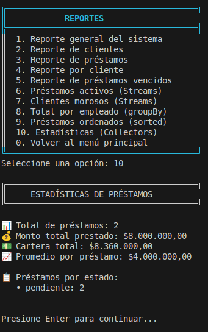

# 🏦 CrediYa S.A.S. - Sistema de Gestión de Préstamos

[](https://www.oracle.com/java/)
[](https://maven.apache.org/)
[](https://www.mysql.com/)
[](https://www.docker.com/)
[](LICENSE)

Sistema de gestión de préstamos y cobros de cartera desarrollado en Java, implementando principios de POO, persistencia dual (MySQL + Archivos), y programación funcional con Streams y Lambdas.

---

## 📋 Tabla de Contenidos

- [Características](#-características)
- [Tecnologías](#-tecnologías-utilizadas)
- [Requisitos Previos](#-requisitos-previos)
- [Instalación](#-instalación)
- [Uso](#-uso)
- [Estructura del Proyecto](#-estructura-del-proyecto)
- [Arquitectura](#-arquitectura)
- [Persistencia de Datos](#-persistencia-de-datos)
- [Ejemplos de Uso](#-ejemplos-de-uso)
- [Capturas de Pantalla](#-capturas-de-pantalla)
- [Documentación Adicional](#-documentación-adicional)
- [Autor](#-autor)
- [Licencia](#-licencia)

---

## ✨ Características

### Módulos Principales

- **👥 Gestión de Empleados**
  - Registro, consulta, actualización y eliminación (CRUD completo)
  - Búsqueda por ID, documento o rol
  - Cálculo automático de nómina mensual y anual
  - Validación de eliminación (verifica préstamos asociados)

- **👤 Gestión de Clientes**
  - CRUD completo de clientes
  - Búsqueda por ID o documento
  - Consulta de préstamos asociados
  - Validación de eliminación

- **💰 Gestión de Préstamos**
  - Creación de préstamos con cálculo automático de intereses
  - Cálculo de cuota mensual y monto total
  - Cambio de estado (pendiente/pagado/vencido)
  - Detección automática de préstamos vencidos
  - Validación: un cliente solo puede tener un préstamo activo

- **💳 Gestión de Pagos**
  - Registro de pagos con actualización automática de saldo
  - Histórico de pagos por préstamo
  - Cálculo de total recaudado
  - Cambio automático de estado a "pagado" cuando saldo = 0

- **📊 Reportes Avanzados**
  - Reporte general del sistema
  - Reportes de clientes y préstamos
  - Préstamos vencidos y clientes morosos
  - **Reportes con Streams/Lambdas:**
    - Préstamos activos (filter)
    - Clientes morosos (filter + map + distinct)
    - Total prestado por empleado (groupingBy)
    - Préstamos ordenados por monto (sorted)
    - Estadísticas generales (Collectors)

### Características Técnicas

- ✅ **POO**: Herencia (Persona → Cliente, Empleado), Polimorfismo, Encapsulamiento
- ✅ **Persistencia Dual**: MySQL (JDBC) + Archivos de texto (.txt)
- ✅ **Patrón DAO**: Implementación con interface genérica `IDao<T>`
- ✅ **Capa de Servicios**: Lógica de negocio separada de persistencia
- ✅ **Excepciones Personalizadas**: Manejo robusto de errores
- ✅ **Validaciones**: Clase `Validador` con regex para correos, documentos, etc.
- ✅ **Streams API**: Uso intensivo de filter, map, collect, sorted, groupingBy
- ✅ **Lambdas**: Expresiones lambda en reportes y operaciones de colecciones
- ✅ **Interfaz Colorida**: Colores ANSI para mejor experiencia de usuario
- ✅ **Docker**: MySQL y phpMyAdmin containerizados

---

## 🛠️ Tecnologías Utilizadas

### Lenguajes y Frameworks

| Tecnología | Versión | Propósito |
|------------|---------|-----------|
| **Java** | 17 LTS | Lenguaje de programación principal |
| **Maven** | 3.8+ | Gestión de dependencias y build |
| **MySQL** | 8.0 | Base de datos relacional |
| **Docker** | Latest | Containerización de MySQL y phpMyAdmin |
| **JDBC** | 8.0.33 | Conectividad con MySQL |

### Dependencias (pom.xml)
```xml
<dependencies>
    <!-- MySQL Connector -->
    <dependency>
        <groupId>com.mysql</groupId>
        <artifactId>mysql-connector-j</artifactId>
        <version>8.0.33</version>
    </dependency>
</dependencies>
```

---

## 📦 Requisitos Previos

Antes de instalar, asegúrate de tener:

- ✅ **Java JDK 17** o superior
- ✅ **Maven 3.8** o superior
- ✅ **Docker** y **Docker Compose**
- ✅ **Git** (para clonar el repositorio)
- ✅ Sistema Operativo: Linux, macOS o Windows con WSL2

### Verificar Instalaciones
```bash
# Verificar Java
java -version

# Verificar Maven
mvn -version

# Verificar Docker
docker --version
docker-compose --version
```

---

## 🚀 Instalación

### Paso 1: Clonar el Repositorio
```bash
git clone https://github.com/Eduar07/SistemaDeCreditos.git
cd SistemaDeCreditos
```

### Paso 2: Iniciar Docker (MySQL + phpMyAdmin)
```bash
docker-compose up -d
```

**Esto iniciará:**
- MySQL en el puerto `3306`
- phpMyAdmin en `http://localhost:8080`

**Credenciales:**
- Usuario: `root`
- Contraseña: `crediya123`
- Base de datos: `crediya_db`

### Paso 3: Compilar el Proyecto
```bash
cd proyecto
mvn clean compile
```

### Paso 4: Ejecutar el Sistema
```bash
mvn exec:java -Dexec.mainClass="com.eduar.MenuPrincipal"
```

---

## 🎮 Uso

### Menú Principal

Al iniciar, verás el menú principal con colores:
```
╔═══════════════════════════════════════╗
║         MENÚ PRINCIPAL               ║
╠═══════════════════════════════════════╣
║  1. Gestión de Empleados             ║
║  2. Gestión de Clientes              ║
║  3. Gestión de Préstamos             ║
║  4. Gestión de Pagos                 ║
║  5. Reportes                         ║
║  0. Salir                            ║
╚═══════════════════════════════════════╝
```

### Flujo de Trabajo Típico

1. **Registrar Empleado** (Menú 1 → Opción 1)
2. **Registrar Cliente** (Menú 2 → Opción 1)
3. **Crear Préstamo** (Menú 3 → Opción 1)
4. **Registrar Pago** (Menú 4 → Opción 1)
5. **Ver Reportes** (Menú 5)

---

## 📁 Estructura del Proyecto
```
SistemaDeCreditos/
├── docker-compose.yml          # Configuración Docker
├── proyecto/
│   ├── pom.xml                 # Configuración Maven
│   ├── data/                   # Archivos de persistencia (.txt)
│   │   ├── empleados.txt
│   │   ├── clientes.txt
│   │   ├── prestamos.txt
│   │   └── pagos.txt
│   └── src/
│       └── main/
│           └── java/
│               └── com/
│                   └── eduar/
│                       ├── MenuPrincipal.java     # Punto de entrada
│                       ├── dao/                   # Capa de acceso a datos
│                       │   ├── IDao.java         # Interface genérica
│                       │   ├── ClienteDAOImpl.java
│                       │   ├── EmpleadoDAOImpl.java
│                       │   ├── PrestamoDAOImpl.java
│                       │   └── PagoDAOImpl.java
│                       ├── excepcion/             # Excepciones personalizadas
│                       │   ├── ClienteException.java
│                       │   ├── EmpleadoException.java
│                       │   ├── PagoException.java
│                       │   └── PrestamoException.java
│                       ├── modelo/                # Clases del dominio
│                       │   ├── Persona.java      # Clase abstracta padre
│                       │   ├── Cliente.java
│                       │   ├── Empleado.java
│                       │   ├── Prestamo.java
│                       │   └── Pago.java
│                       ├── servicio/              # Lógica de negocio
│                       │   ├── ClienteServicio.java
│                       │   ├── EmpleadoServicio.java
│                       │   ├── PrestamoServicio.java
│                       │   ├── PagoServicio.java
│                       │   └── ReporteServicio.java
│                       └── util/                  # Utilidades
│                           ├── ArchivoUtil.java
│                           ├── ColoresConsola.java
│                           ├── ConexionDb.java
│                           ├── ConstantesJava.java
│                           └── Validador.java
└── docs/
    ├── Manual.md               # Manual de usuario
    ├── UML.png                 # Diagrama de clases
    └── capturas/               # Capturas de pantalla
```

---

## 🏗️ Arquitectura

### Patrón de Capas (Layered Architecture)
```
┌─────────────────────────────────────┐
│     Capa de Presentación            │
│     (MenuPrincipal.java)            │
└──────────────┬──────────────────────┘
               │
┌──────────────▼──────────────────────┐
│     Capa de Servicio                │
│     (Lógica de Negocio)             │
│  - ClienteServicio                  │
│  - EmpleadoServicio                 │
│  - PrestamoServicio                 │
│  - PagoServicio                     │
│  - ReporteServicio                  │
└──────────────┬──────────────────────┘
               │
┌──────────────▼──────────────────────┐
│     Capa DAO (Persistencia)         │
│  - IDao<T> (Interface)              │
│  - ClienteDAOImpl                   │
│  - EmpleadoDAOImpl                  │
│  - PrestamoDAOImpl                  │
│  - PagoDAOImpl                      │
└──────────────┬──────────────────────┘
               │
       ┌───────┴────────┐
       │                │
┌──────▼─────┐  ┌───────▼────────┐
│   MySQL    │  │  Archivos .txt │
│   (JDBC)   │  │  (data/)       │
└────────────┘  └────────────────┘
```

### Modelo de Dominio (Herencia)
```
         ┌──────────────┐
         │   Persona    │ (abstracta)
         │─────────────│
         │ - id         │
         │ - nombre     │
         │ - documento  │
         │ - correo     │
         └──────┬───────┘
                │
        ┌───────┴────────┐
        │                │
┌───────▼──────┐  ┌──────▼────────┐
│   Cliente    │  │   Empleado    │
│─────────────│  │───────────────│
│ - telefono   │  │ - rol         │
│              │  │ - salario     │
└──────────────┘  └───────────────┘
```

---

## 💾 Persistencia de Datos

### Doble Persistencia (MySQL + Archivos)

El sistema implementa **persistencia dual** para cumplir con los requisitos académicos y proporcionar un backup automático:

#### 1. **MySQL (Principal)**
- Base de datos relacional con 4 tablas
- Relaciones con claves foráneas (FK)
- Consultas con JDBC y PreparedStatement
- Transacciones para integridad de datos

#### 2. **Archivos de Texto (Backup)**
- Formato: CSV con delimitador `|`
- Ubicación: `data/`
- Archivos generados:
  - `empleados.txt`
  - `clientes.txt`
  - `prestamos.txt`
  - `pagos.txt`

**Ejemplo de archivo `empleados.txt`:**
```
5|Laura Martínez|1122334455|laura.martinez@crediya.com|Contador|3200000.00
```

### Sincronización Automática

Cada operación de **guardar** se escribe en **ambos sistemas**:
```java
// En el DAO
public void guardar(Empleado empleado) {
    // 1. Guardar en MySQL
    // ... código JDBC ...
    
    // 2. Guardar en archivo
    ArchivoUtil.guardarLinea("data/empleados.txt", linea);
}
```

---

## 📖 Ejemplos de Uso

### Ejemplo 1: Crear un Préstamo Completo
```java
// 1. Registrar Cliente
Cliente cliente = new Cliente("Juan Pérez", "1098765432", 
                               "juan@email.com", "3227886539");
clienteServicio.registrarCliente(cliente);

// 2. Registrar Empleado
Empleado empleado = new Empleado("Ana García", "1234567890",
                                  "ana@crediya.com", "Asesor", 2800000);
empleadoServicio.registrarEmpleado(empleado);

// 3. Crear Préstamo
// Monto: $5,000,000 | Interés: 5.5% | Cuotas: 12 meses
prestamoServicio.crearPrestamo(
    cliente.getId(), 
    empleado.getId(), 
    5000000, 
    5.5, 
    12, 
    LocalDate.now()
);

// Resultado:
// Monto total: $5,275,000 (capital + interés)
// Cuota mensual: $439,583.33
```

### Ejemplo 2: Registrar un Pago
```java
// Registrar pago de $500,000 al préstamo #1
pagoServicio.registrarPago(1, 500000, LocalDate.now(), "Pago inicial");

// El sistema automáticamente:
// 1. Reduce el saldo pendiente
// 2. Guarda en MySQL
// 3. Guarda en data/pagos.txt
// 4. Cambia estado a "pagado" si saldo = 0
```

### Ejemplo 3: Reporte con Streams
```java
// Obtener clientes morosos usando Streams
ArrayList<Cliente> morosos = prestamoServicio.listarTodos().stream()
    .filter(p -> p.estaVencido())
    .map(Prestamo::getCliente)
    .distinct()
    .collect(Collectors.toCollection(ArrayList::new));

// Total prestado por empleado usando groupingBy
Map<String, Double> totalPorEmpleado = prestamos.stream()
    .collect(Collectors.groupingBy(
        p -> p.getEmpleado().getNombre(),
        Collectors.summingDouble(Prestamo::getMonto)
    ));
```

---

## 📸 Capturas de Pantalla

### Menú Principal


### Registro de Préstamo


### Reporte de Estadísticas


---

## 📚 Documentación Adicional

- **[Manual de Usuario](docs/Manual.md)** - Guía paso a paso para usuarios finales
- **[Diagrama UML](docs/diagrama_clases.png)** - Diagrama de clases completo
- **JavaDoc** - Documentación del código en `target/site/apidocs/`

### Generar JavaDoc
```bash
mvn javadoc:javadoc
```

El JavaDoc estará disponible en: `proyecto/target/site/apidocs/index.html`

---

## 👨‍💻 Autor

**Eduar Humberto Guerrero Vergel**
- 📧 Email: edhuarguerrero@gmail.com
- 🐙 GitHub: https://github.com/Eduar07


**Institución:** [Campusland]  
**Fecha:** Diciembre 2025  
**Versión:** 1.0

---

## 📄 Licencia

Este proyecto está bajo la Licencia MIT. Consulta el archivo [LICENSE](LICENSE) para más detalles.

---

## 🙏 Agradecimientos

- Profesor: Adrian Parchao
- Documentación oficial de Java, MySQL y Maven

---

## 📞 Soporte

Si encuentras algún error o tienes sugerencias:

1. Abre un **Issue** en GitHub
2. Envía un correo a [eduarguerrero@gmail.com]
3. Revisa la sección de **[Issues]https://github.com/Eduar07/SistemaDeCreditos.git

---

**⭐ Si este proyecto te fue útil, dale una estrella en GitHub!**